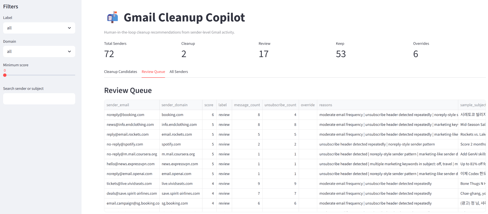
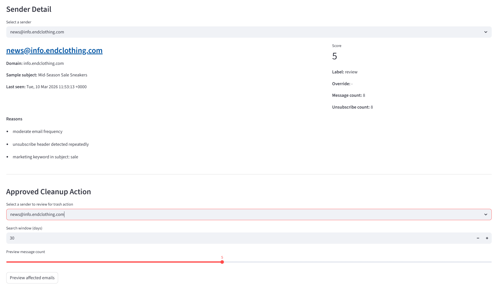
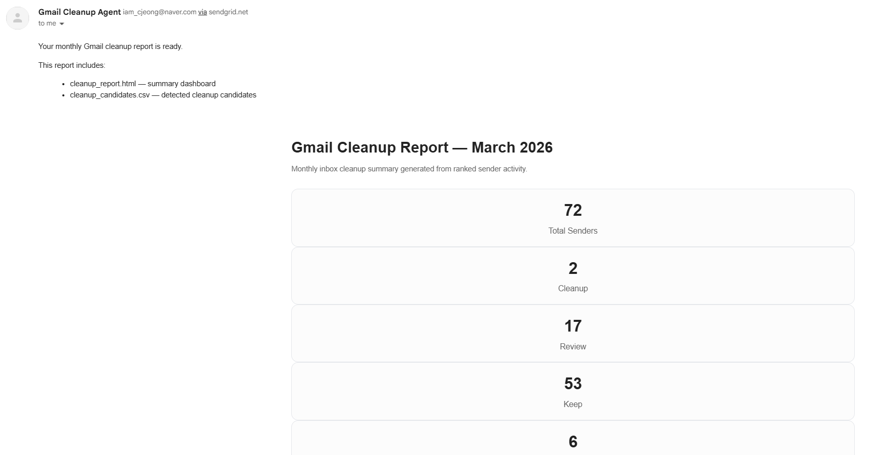
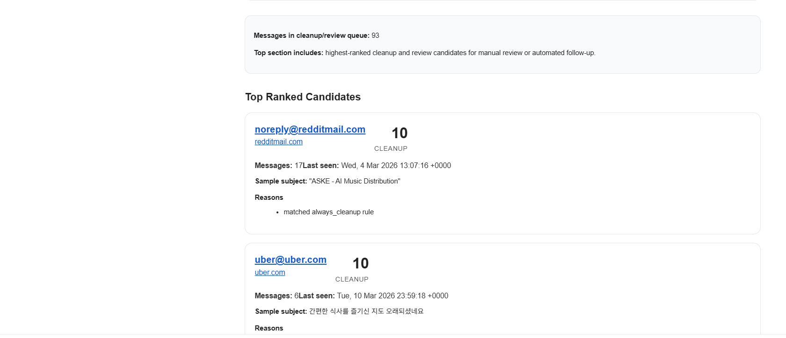
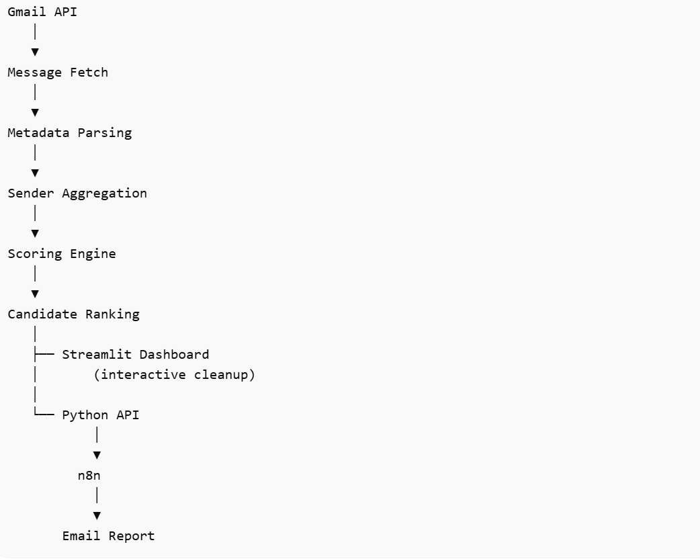
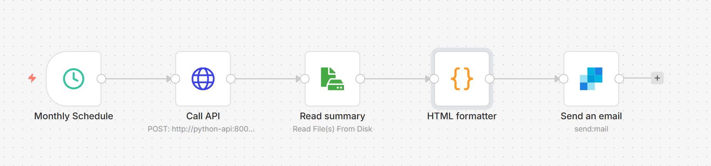

# Gmail Cleanup Copilot

Human-in-the-loop Gmail cleanup assistant with automated monthly reporting.

Modern inboxes accumulate large volumes of automated and promotional emails. While email clients provide filters and unsubscribe links, they rarely offer a structured way to understand which senders contribute most to inbox clutter.

As a result, inbox cleanup often becomes a repetitive and manual task.

Gmail Cleanup Copilot analyzes Gmail activity at the sender level, identifies low-value senders, and produces ranked cleanup recommendations with explanations.

The system combines data analysis, explainable ranking, and workflow automation to turn inbox cleanup from an ad-hoc task into a structured process.

---
## Problem

Large inboxes often contain hundreds of automated notifications, newsletters, and marketing emails.

Existing email tools provide limited support for answering questions such as:

* Which senders contribute most to inbox clutter?
* Which sources send high-frequency low-value emails?
* Which messages can be safely cleaned up?

Without sender-level visibility, users must manually inspect individual emails, making inbox cleanup inefficient and repetitive.

---
## Solution

Gmail Cleanup Copilot introduces a sender-level inbox analysis pipeline that aggregates Gmail activity and ranks cleanup candidates.

The system operates in two complementary modes:

### Interactive Cleanup Dashboard

A Streamlit interface that visualizes sender activity and allows users to review cleanup candidates before taking action.

Features include:

* ranked sender recommendations
* explainable cleanup reasons
* sender-level inbox insights
* human approval before cleanup actions

### Automated Monthly Reporting

A scheduled workflow that analyzes inbox activity and generates a monthly cleanup report.

The report sumarizes:

* sender activity
* cleanup candidates
* review candidates
* inbox clutter trends

The report is automatically generated and delivered via email using an orchestrated workflow.

---

## Demo

### Interactive Dashboard



The dashboard visualizes ranked cleanup candidates and provides sender-level insights.


### Sender-Level Detail & Follow Clean-up Action



Each sender includes an explainable breakdown of why it was flagged as a cleanup candidate. Subsequently, detected emails from send can be trashed by user-driven decision.


### Monthly Cleanup Report





A generated HTML report summarizing inbox cleanup recommendations.


## System Architecture

Gmail Cleanup Copilot is designed as a modular pipeline separating data ingestion, analysis, user interaction, and workflow orchestration.



The architecture seperates the analysis pipeline from the automation layer, allowing the system to support both interactive cleanup workflows and scheduled reporting.

---

## Key Engineering Decisions

### Sender-Level Analysis

Instead of analyzing individual messeages, the system aggregates email activity by sender.

This approach allows the system to detect patterns such as:

* high-frequency senders
* automated notifications
* promotional email sources
* unsubscribe-enabled messages

Sender-level analysis provides a clearer signal for cleanup decisions.


### Explainable Ranking

Cleanup candidates are ranked using a rule-based scoring system that considers:

* message frequency
* unsubscribe headers
* marketing keywords
* no-reply patterns
* user override rules

Each recommendation includes **explainable reasons** to support user decision-making.


### Human-in-the-Loop Workflow

Cleanup actions are not executed automatically.

Users review ranked candidates throught the dashboard before applying cleanup actions, ensuring safe inbox management.


### API-Based Pipeline

The cleanup pipeline is exposed through a lightweight API service.

This allows external systems to trigger analysis workflows programmatically, enabling integration with automation tools.


### Workflow Orchestration

Automation is handled using **n8n**, which schedules and orchestrates periodic tasks.

The monthly workflow:

1. trigggers the cleanup pipeline via th API
2. generates a cleanup report
3. sends the report via email



This architecture decouples analysis logic from workflow scheduing.

---

## Tech Stack

* Python
* Gmail API
* Pandas
* Streamlit
* Docker
* n8n (workflow orchestration)
* SendGrid (email delivery)

---

## Example Output
```
=== Sender-level summary ===
                                            sender_email                   sender_domain  message_count                             last_seen  unsubscribe_count                                 
                                   sample_subject
                                  noreply@redditmail.com                  redditmail.com             13        Wed, 4 Mar 2026 13:07:16 +0000                  0                                 
                   "ASKE - AI Music Distribution"
account-security-noreply@accountprotection.microsoft.com accountprotection.microsoft.com             11       Wed, 11 Mar 2026 01:54:32 -0700                  0                                 
       Microsoft account unusual sign-in activity
                             tickets@live.vividseats.com             live.vividseats.com              9       Wed, 11 Mar 2026 16:17:46 +0000                  9                                 
      Bone Thugs N Harmony in Katy Next Saturday!
```

---

## Running the Project

### Install dependencies
```
pip install -r requirements.txt
```

### Run analysis pipeline
```
python main.py
```

### Launch Streamlit dashboard
```
streamlit run app/streamlit_app.py
```

### Run with Docker
```
docker compose up
```

---

## Future Improvement

* automated unsubscribe actions
* sender-level trend analysis
* LLM-assisted email categorization
* inbox clutter metrics over time
